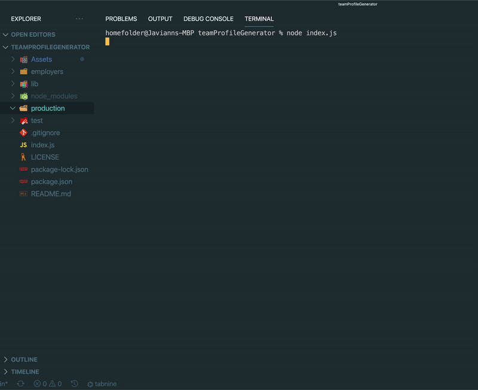
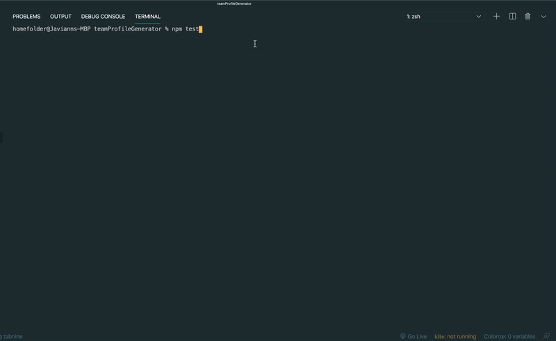

# 10 Object-Oriented Programming: Team Profile Generator

# teamProfileGenerator

## Table of Contents
* [Intro](#intro)
* [Demo](#demo)
* [Sample](#sample)
* [Installations](#installations)
* [Created by](#created-by)
* [Repository](#repository)
* [License](#license)

 ## Introduction
The Team Profile Generator is a command-line-input application run in Node that requests information from the user about members of an engineering team and generates an HTML file displaying that information.

## Demo

### Test

## Sample 
 This is a sample of the team profile generator.
* Sample [README.md](./production/team.html)

## Installations
Type the following npm install commands one at a time: npm i, npm install jest, npm install inquirer in the command line while in the teamProfileGenerator folder. 

* [npm](https://docs.npmjs.com/cli/v7/commands/npm-install)
  * npm is the package manager for the Node JavaScript platform. 

* [jest](https://www.npmjs.com/package/jest)
  * Jest is a JavaScript testing framework designed to ensure correctness of any JavaScript codebase.

* [inquirer](https://www.npmjs.com/package/inquirer)
  * A collection of common interactive command line user interfaces.

## Created by
* [Javiann Marrero](https://github.com/javiistacks)

## Repository
### Github Repository
Repository at [myReadme](https://github.com/javiistacks/teamProfileGenerator)

## License

Copyright (c) Javiann Marrero. All rights reserved. 
Please be kind and change content if you wish to use this code.

Licensed under the MIT License

Copyright (c) 2021 - present | Javiann Marrero

<blockquote>
Permission is hereby granted, free of charge, to any person obtaining a copy
of this software and associated documentation files (the "Software"), to deal
in the Software without restriction, including without limitation the rights
to use, copy, modify, merge, publish, distribute, sublicense, and/or sell
copies of the Software, and to permit persons to whom the Software is
furnished to do so, subject to the following conditions:

The above copyright notice and this permission notice shall be included in all
copies or substantial portions of the Software.

THE SOFTWARE IS PROVIDED "AS IS", WITHOUT WARRANTY OF ANY KIND, EXPRESS OR
IMPLIED, INCLUDING BUT NOT LIMITED TO THE WARRANTIES OF MERCHANTABILITY,
FITNESS FOR A PARTICULAR PURPOSE AND NONINFRINGEMENT. IN NO EVENT SHALL THE
AUTHORS OR COPYRIGHT HOLDERS BE LIABLE FOR ANY CLAIM, DAMAGES OR OTHER
LIABILITY, WHETHER IN AN ACTION OF CONTRACT, TORT OR OTHERWISE, ARISING FROM,
OUT OF OR IN CONNECTION WITH THE SOFTWARE OR THE USE OR OTHER DEALINGS IN THE
SOFTWARE.
</blockquote>

